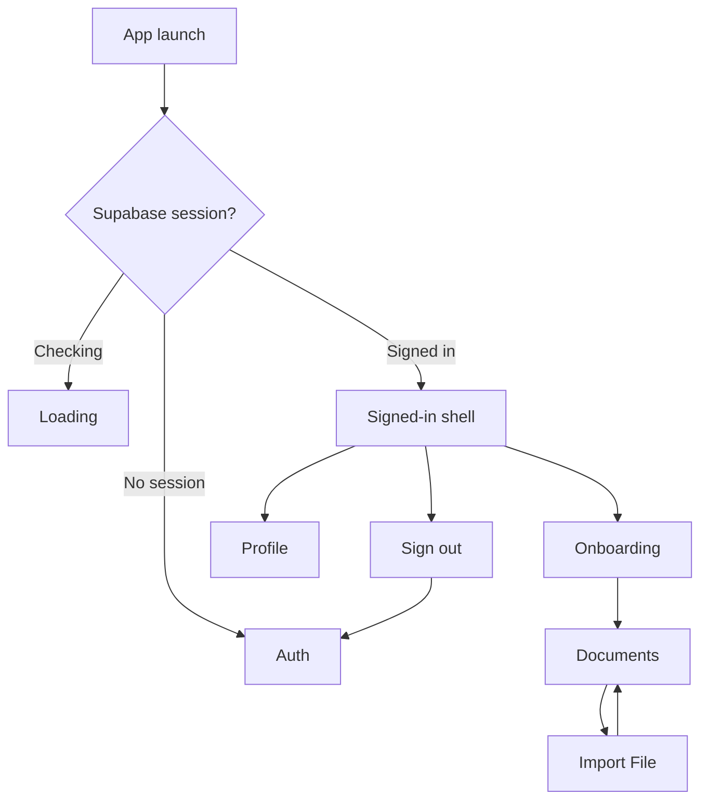

# Android Navigation

FamilyVault uses Jetpack Compose navigation instead of XML navigation graphs.

The central graph lives in:

```text
apps/android/app/src/main/java/com/familyvault/app/core/navigation/AppNavGraph.kt
```

Routes are modeled in `AppRoute.kt` as a sealed interface. This keeps route names centralized and lets future routes carry arguments, such as `DocumentDetail(documentId)`.

## Current Routes

```text
Auth
Onboarding
Documents
ImportFile
Profile
```

## Current Routing Behavior



`FamilyVaultApp` owns app-level session routing. `SignedInAppShell` owns the signed-in `NavHostController` so the overflow menu can navigate to Profile.

Current limitation: signed-in users start at Onboarding because vault membership lookup is not implemented yet. Later routing should become:

```text
Signed in + active vault membership -> Documents
Signed in + no active vault membership -> Onboarding
```