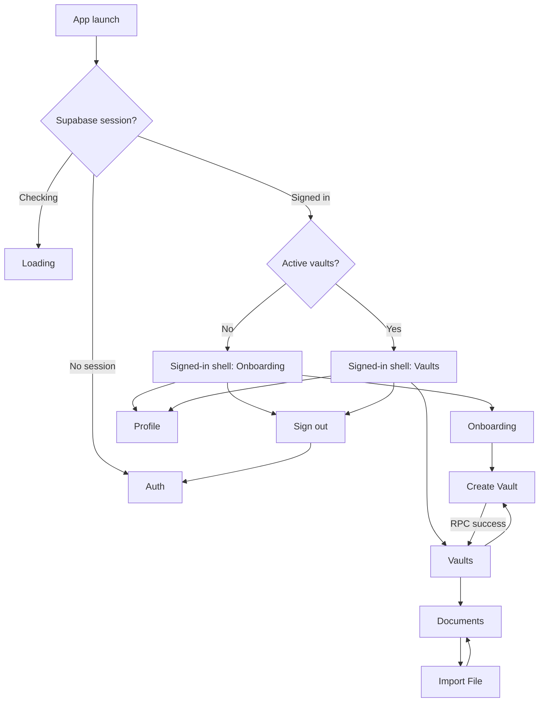

# Android Navigation

FamilyVault uses Jetpack Compose navigation instead of XML navigation graphs.

The central graph lives in:

```text
apps/android/app/src/main/java/com/familyvault/app/core/navigation/AppNavGraph.kt
```

Routes are modeled in `AppRoute.kt` as a sealed interface. This keeps route names centralized and lets future routes carry arguments, such as `DocumentDetail(documentId)`.

## Current Routes

```text
Auth
Onboarding
CreateVault
Vaults
Documents
ImportFile
Profile
```

## Current Routing Behavior



`FamilyVaultApp` owns app-level session routing. `AppViewModel` resolves the signed-in start destination by calling the `public.my_vaults` RPC. `SignedInAppShell` owns the signed-in `NavHostController`; the profile avatar navigates to Profile and the overflow menu handles secondary actions such as sign out.

If the user has no active vault memberships, the signed-in shell starts at Onboarding. If active memberships exist, it starts at Vaults. Create Vault can create the first vault through the `public.create_vault` RPC and then routes to Vaults. Vaults loads the current user's active vault memberships through the `public.my_vaults` RPC. The populated list uses a bottom-right add action that opens Create Vault or Join with invite code options.